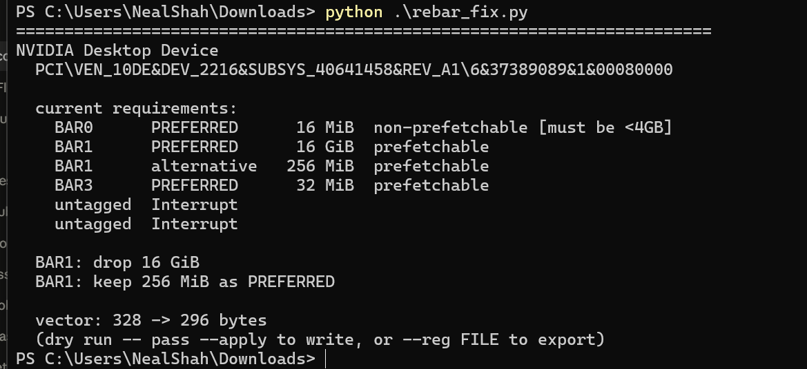
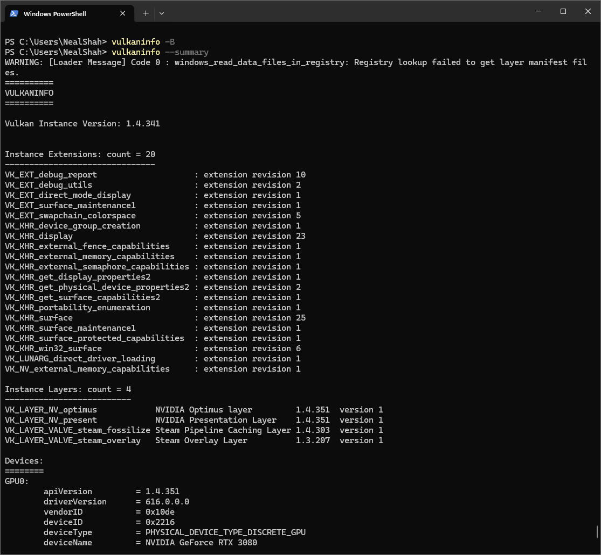
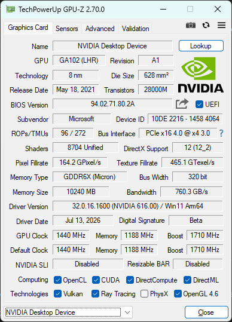

# eGPU on (I think) ANY Qualcomm Laptop

After consulting the Claude, I've realized its possible to configure the memory maps and disable rebar WITHOUT using patched ACPI tables. I have tested this myself and I currently have testsigning off and have GPU working!

All you have to do is Install the nvidia RTX Spark drivers manually by doing the following:

1. Download "RTX Spark Developer Driver" from https://forums.developer.nvidia.com/t/rtx-spark-developer-preview/377106
2. Extract EXE with 7zip. 
3. Open Device Manager, Locate Microsoft Basic Display Adapter. Right Click, Open Properties
4. Navigate to driver tab at the very top, click "Update Driver", then "Browse my Computer for Drivers"
5. Click "Let me pick from a list of available drivers on my computer" at the bottom
6. Select "Have Disk?" and navigate to the 7zip extracted nvidia driver folder
7. Select Nvidia Desktop Device

Now reboot (keep eGPU plugged in)

You'll see device manager show Nvidia Desktop Device as Code 12. Run the following script as admin
`python rebar_fix.py`. You should see your GPU as follows.

If you see it and its the device you would like to adjust the memory maps of. Do the following:
1. `python rebar_fix.py --apply`
2. Disconnect your GPU
3. Reconnect your GPU to the SAME port
4. Wait about 30 seconds (keep device manager open)

You should see your eGPU connected monitors fire up and device manager mark "Nvidia Desktop Device" as "This device is working properly".

